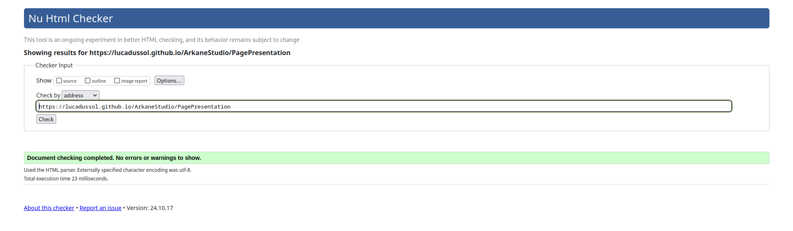

# SAE S1.05-06

## Arkane Studio    

Arkane Studio (https://lucadussol.github.io/ArkaneStudio)

## Membres du groupe :
Etudiant 1 (référent du groupe) : [DUFOSSEZ Oscar](mailto:odufosse@edu.univ-fcomte.fr?subject=SAE_1_05_06)  
Etudiant 2 : [DUSSOL Luca](ldussol@edu.univ-fcomte.fr?subject=SAE_1_05_06)     
Etudiant 3 : [DUPASQUIER Eloi](edupasqu@edu.univ-fcomte.fr?subject=SAE_1_05_06)   
Etudiant 4 : [DUMAIN Mathias](mdumain@edu.univ-fcomte.fr?subject=SAE_1_05_06)    
Etudiant 5 : [HETRU Owen](ohetru@edu.univ-fcomte.fr?subject=SAE_1_05_06)   

# Présentation du projet

Ce projet est un projet collaboratif de première année de BUT INFORMATIQUE. Nous devons présenter une entreprise
et son environnement économique au travers d'un site web que nous aurons codé de bout en bout.
Le travail a été réparti comme suit :
- L'accueil a été codé par Oscar DUFOSSEZ
- La page de présentation de l'entreprise a été codée par Owen HETRU
- La page sur les chiffres a été codée par Luca DUSSOL
- La page de l'environnement économique a été codée par Eloi DUPASQUIER
- La page des actualités du studio a été codée par Mathias DUMAIN

La palette de couleur générale est inspirée de la charte colorée du jeu à succès DEATLOOP. Nous avons opté pour un dégradé afin de ne pas surcharger 
la page et garder la page aérée et lisible.

# Validations des pages
## Page accueil
[Lien](https://validator.w3.org/nu/?doc=https%3A%2F%2Flucadussol.github.io%2FArkaneStudio%2F)

## Page Présentation
[Lien](https://validator.w3.org/nu/?doc=https%3A%2F%2Flucadussol.github.io%2FArkaneStudio%2FPagePresentation)

## Page En ce moment
[Lien](https://validator.w3.org/nu/?doc=https%3A%2F%2Flucadussol.github.io%2FArkaneStudio%2FPageEnCeMoment.html)

## Page Chiffres
[Lien](https://validator.w3.org/nu/?doc=https%3A%2F%2Flucadussol.github.io%2FArkaneStudio%2FPageChiffre)

## Page Economie

# Ecologie des pages
## Page Accueil
[Lien](https://ecograder.com/report/mgrc1CAFqxQccJiTLSP8rCPz)

## Page Présentation
[Lien](https://ecograder.com/report/rf7WlhITihUK6aPwwV77uSq2)

## Page En ce moment
[Lien](https://www.websitecarbon.com/website/lucadussol-github-io-arkanestudio-pageencemoment-html/)

## Page Chiffres
[Lien]

## Page Economie
